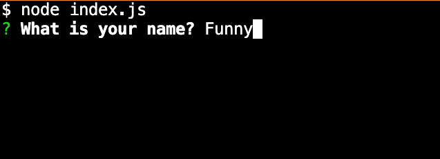

# Mini-Project

In this activity, you will build a command-line tool that generates an HTML portfolio page from user input.

## Instructions

---

[Link to Generated README](https://github.com/antcoop/video-record-demo/blob/main/home.html)

[Link to Repo](https://github.com/antcoop/video-record-demo)

[Link to Video](https://drive.google.com/file/d/1wG2ePnndOAqibIxS_nkWMz-uWTbbvuWj/view?usp=sharing)

* Your application should prompt the user for information like their name, location, bio, LinkedIn URL, and GitHub URL. Feel free to add any additional prompts you think of.

* An HTML document containing the information collected from the prompts should be constructed and written to the file system. Be sure to add some CSS styling to the document.

* You’ll need the following tools and technologies to accomplish this:

  * `fs` for writing to the file system

  * `inquirer` for collecting user input

  * String template literals for generating a string version of the HTML document before it is written to the file system

## 💡 Hints

It might be a good idea to start building out the HTML skeleton in a real HTML file. Once you're happy with the HTML file's appearance in the browser, you can copy and paste its contents into a string template literal. Then you can write a function to insert the user input into the appropriate places in the HTML string before writing it to the file system.

## 🏆 Bonus

* Instead of using callback functions, what are some other tools in JavaScript we can use to handle asynchronous functionality?

---

© 2021 Trilogy Education Services, LLC, a 2U, Inc. brand. Confidential and Proprietary. All Rights Reserved.
